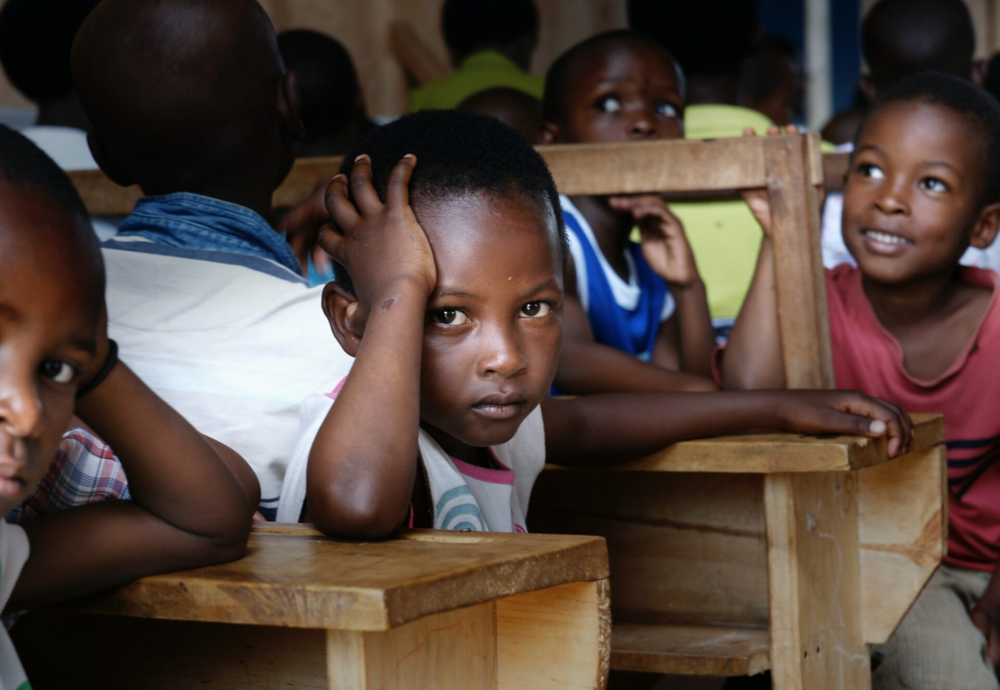

<body>
   <header>
     <nav>
      

      <a href=""class="Homal">Home</a>
      <a href="">About us </a>
      <a href="">Our Programs</a>
      <a href="">Contact Us</a>
      <a href="">Blog</a>
      
Join Us</button>
    </nav>
</header>
  

   

      <h2>EDUCATION FOR ALL</h2>
      
As economically disadvantaged chidren who do not have the   
         needed support to excel in our academic career, we know the  
         difference that Access Program makes in our lives and believe  
         every child deserves to go to in good conditions.

      
About Us

   

  

  

    
    
 <h1 style="font-family: 'Dosis',sans-serif;"> <strong> WELCOME TO THE  
      ENGLISH ACCESS ALUMNI NETWORK</strong></h1>

   
 <h5 style="font-family:'Segoe UI', Tahoma, Geneva, Verdana, sans-serif"> Through this project, we aim at  putting in place effective follow up and monitoring evaluation tools for the Access Microscholarship program after completion of the program. Also, this will provide capacity building for former Access beneficiaries to become valuable members of the emerging voices audiences.  Finally, this initiative will enhance Access former beneficiaries preparedness to become potential candidates for US government exchange programs and fully engaged for the development of their communities. </h5>

   
About Us

   <iframe width="800" height="500" src="https://www.youtube.com/embed/XHOmBV4js_E" title="Video Placeholder" frameborder="0" allow="accelerometer; autoplay; clipboard-write; encrypted-media; gyroscope; picture-in-picture" allowfullscreen style="margin-left:-3vh;margin-top:30vh"></iframe>

   

   

    <h3>  WHAT WE DO </h3>
    

    
<h4 style="line-height:4.9vh">Lorem ipsum dolor sit amet, consectetur adipiscing elit.   Ut elit tellus, luctus nec ullamcorper mattis, pulvinar   dapibus leo.</h4>

    
<h4 style="line-height:4.9vh">Lorem ipsum dolor sit amet, consectetur adipiscing elit.   Ut elit tellus, luctus nec ullamcorper mattis, pulvinar   dapibus leo.</h4>

    
About Us

   

 

 

 

   

   <h1 style="font-weight:800;font-family:'Dosis',sans-serif;color:#0A3161;letter-spacing:0.1rem">MEMBERS BENEFITS</h1>
   
   

      

          <h1 style="font-weight:800;font-family:'Dosis',sans-serif;color:#0A3161;letter-spacing:0.04rem"> TRAINING OPPORTUNITIES </h1>

      

         <h1 style="font-weight:800;font-family:'Dosis',sans-serif;color:#0A3161;letter-spacing:0.04rem"> SCHOLARSHIP OPPORTUNITIES </h1>
      
      

      

         <h1 style="font-weight:800;font-family:'Dosis',sans-serif;color:#0A3161;letter-spacing:0.04rem"> 
         US DEPT EXCHANGE PROGRAMS </h1>
      
      

      

         <h1 style="font-weight:800;font-family:'Dosis',sans-serif;color:#0A3161;letter-spacing:0.04rem"> 
         PROFESSIONAL CAREER</h1>
         
      

   

   
Being a member of this network yields precious advantages :  Key trainings are offered to members ranging from leadership, computer science to entrepreneurship, project management, and more. Active members have the chance to apply to scholarship opportunities,  offered mainly by US universities. Former Access students who are still engaged in their communities have this unique opportunity to be selected for exchange programs in the US offered by the US Department of State. Thanks to the opportunities mentioned above and career-oriented trainings offered to the members of this network, the latter are well-equipped to enter the work market and succeed their career and serve as mentors and coaches for current and future Access students. 

 

   <h1 style="color:#0A3161;font-weight:800;font-family:'Dosis',sans-serif;letter-spacing:0.05rem;font-size:7.2vh">What's New?</h1>
   
   

      

      <h2 style="color:#54595F;font-family:'Segoe UI', Tahoma, Geneva, Verdana, sans-serif;font-size:3.5vh;text-align:left;margin-left:4vh">Bonjour tout le monde !</h2>
      <h3 style="color:gray;font-family:'Segoe UI', Tahoma, Geneva, Verdana, sans-serif;font-size:2.5vh;text-align:left;letter-spacing:0.01rem;margin-left:4vh;width:90%">Bienvenue sur WordPress. Ceci est votre  premier  
         article. Modifiez-le ou supprimez-le, puis 
         commencez à écrire !</h3>
   

   <h1 style="font-weight:800;font-family:'Dosis',sans-serif;color:#0A3161;letter-spacing:0.1rem;font-size:5.5vh">EXPLORE OUR PHOTOS</h1>
   

      

      
      
      
      
   

   

  

 
  <h3 class="Fo_Texto"style="margin-top:-4vh">English Access Alumni </h3>
  <h3 class="Fo_Texto">Community Language Center building,  
   Attiégou-Lomé,  
   Tel: 90946571</h3>
   

      

         <h4 style=" color: white;
         font-size: 3.1vh;
         font-family: 'Segoe UI', Tahoma, Geneva, Verdana, sans-serif;font-weight:600">Follow Us</h4>
      

      

         
      

   

   

   <h4 style=" color: white;
   font-size: 3.1vh;
   font-family: 'Segoe UI', Tahoma, Geneva, Verdana, sans-serif;font-weight:600">2022 English Access Alumni.</h4>

 
</body>
nav{
    display: flex;
    font-family: Arial, Helvetica, sans-serif;
   
    position: fixed;
    background-color: white;
    width: 210vh;
    height: 15vh;
    justify-content: space-between;
}

header{
    position: sticky;
    background-color: white;
    margin-top: -1.3vh;
}
.Toget4Ch{
    background: url('bill-wegener-LqOO5Ko0zSo-unsplash.jpg');
    height: 110vh;
    background-size: cover;
}
a{
  text-decoration: none;
  color: black;
  font-weight: bold;
  margin-top: 4vh;
}
a:hover{
    color:#B31942
}

.Homal{
  color: #B31942;
}
.JU{
  font-family: 'Dosis', sans-serif;
  color: #B31942;
  border-color: #B31942;
  border-style: solid;
  width:20vh;
  height: 5.8vh;
  text-align: center;
  border-radius: 3vh;
  box-shadow: 0 0 2vh gray;
  margin-top: 2.7vh;
  font-size: 3.2vh;
  font-weight: light;
  margin-right: 3vh;
}
.EFA{
  font-family: 'Dosis',sans-serif;
  background-color: white;
  opacity: 0.9;
  height: 38vh;
  width: 40%;
  margin-left: 5vh;
  transform: translateY(60vh);
  font-weight: bold;
  padding: 1vh;
  padding-left: 2vh;
  
}
.Text{
    font-family:'Segoe UI', Tahoma, Geneva, Verdana, sans-serif ;
    color: #0A3161;
}
h2{
    color: #0A3161;  
}
.AU{
    background-color: #B31942;
    width: 18vh;
    height: 5vh;
    color:white;
    padding: 1vh;
    border-radius: 1.2vh;
    text-align: center;
}
.Info{
    text-align: center;
    margin-top: 9vh;
    
    color: #0A3161;
    font-size: 3.6vh;
   letter-spacing: 0.15rem;
   width: 60%;
   margin-left: 40vh;
}
.AU1{
    background-color: #0A3161;
    width: 18vh;
    height: 5vh;
    color:white;
    padding: 1vh;
    border-radius: 1.2vh;
    text-align: center;
    font-family: 'Segoe UI', Tahoma, Geneva, Verdana, sans-serif;
    font-size: 3.2vh;
    letter-spacing: 0.1rem;
    align-items: center;
    margin-left: 55vh;
}
.mes{
    width: 20vh;
    font-family: 'Segoe UI', Tahoma, Geneva, Verdana, sans-serif;
    letter-spacing: 0.1rem;
}
.Contain{
    display: flex;
    margin-top: 28vh;
    margin-left: 21vh;
    margin-top: 25vh;
    
}
.container{
  background-color: #0A3161; 
  width: 80vh; 
  margin-top: -10vh;
  height: 120vh;
  font-family: 'Segoe UI', Tahoma, Geneva, Verdana, sans-serif;
  color:white;
  padding-left: 8.2vh;
  
}
.Deg{
   background-color: skyblue;
   height:30vh;
   opacity:0.1;
   margin-top: -30vh;
}
.MB{
    text-align: center;
    margin-top: 10vh;
}
.Cont{
    display: flex;
    justify-content: space-around;
    
}
.Stars{
    width:20%;
    font-size: 2vh;
}
.WN{
height: 85vh;
background-color: #ECECEC;
text-align: center;
}
.Arti{
  background-color: white;
  height: 65vh;
  width:56vh;
  margin-left:8vh;
  box-shadow: 0 0 1vh grey;
  border-radius: 1vh;
}
.Phot{
   text-align: center;
   height:80vh;
   background-color: white;
}
.Footer{
    background-color: #0A3161;
    height: 60vh;
    text-align: center;
    margin-top: 10vh;
}
.Fo_Texto{
    color: white;
    font-size: 3.8vh;
    font-family: 'Segoe UI', Tahoma, Geneva, Verdana, sans-serif;
}
.Flb{
    display: flex;
    align-items: center;
    justify-content: center;
}
.Carous{
    display: flex;
    width: 400vh;
    animation-duration:10s ;
    animation-name: Mes;
    animation-iteration-count: infinite;
    height: 200vh;
}
@keyframes Mes{
    0%{
        transform : translateX(0vh);
        
    }
    25%{
        transform: translateX(-45vh);
    }
    50%{
        transform: translateX(-90vh);
    }
   
    
}
